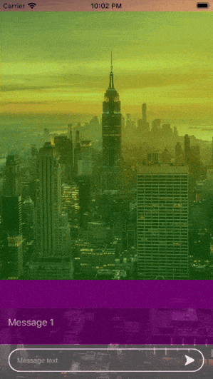

# GLFloatingPanel

A container that presents a scrolling area that shows the content and allows the user to interact with it in a flexible animation style.

### Main UI components:
 * `content area` - define the content you want to show to user
 * `transparent area` - define the top offset for your content
 * `delegate` - methods for managing and configuring content view in Floating Panel
 * `datasource` - methods adopted by the object you use to manage UI components on the Floating Panel
 
### Architecture

##### Core
* `Protocols` - contains a delegate and data source protocols
* `ViewControllers` - contains floating panel controller specializes in managing a floating panel view 
* `Views` - floating panel views
* `Model` - few entities to handle floating panel operations

## Authors
* **Alexey Gross** - *Initial work* - [alexey.gross][AG]
* **Mikhail Li** - [mikhail.li][ML]

[AG]: https://github.com/grosshub
[ML]: https://github.com/l1nkey
